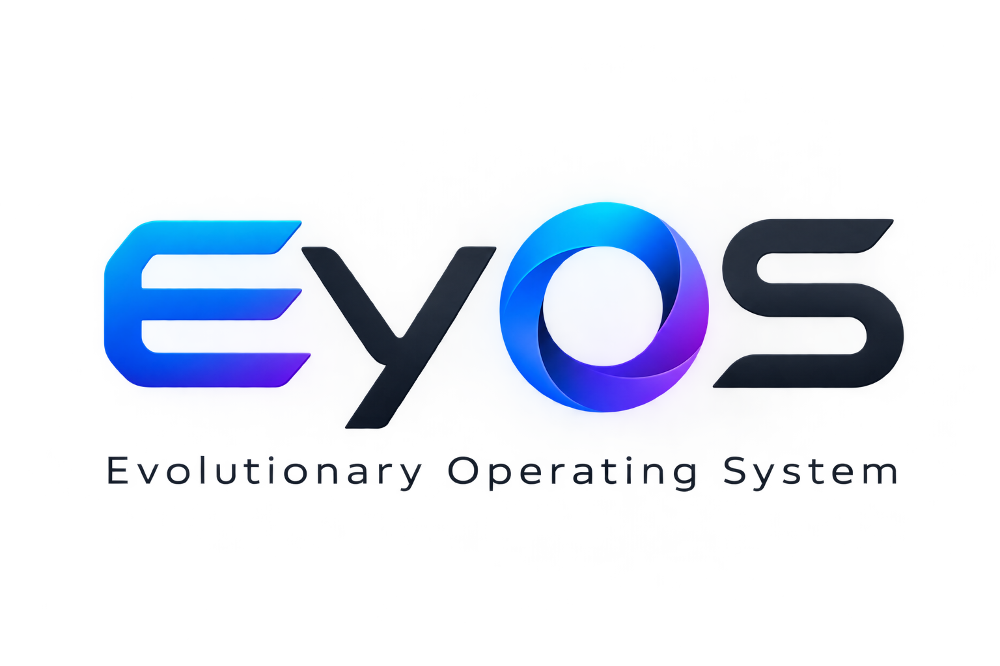
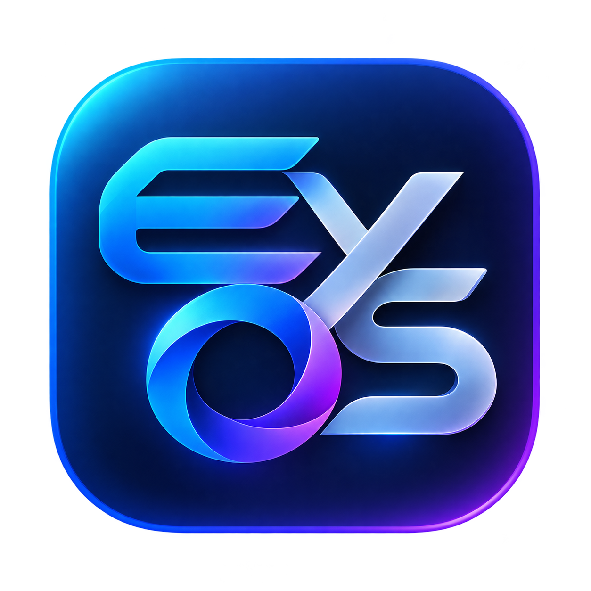
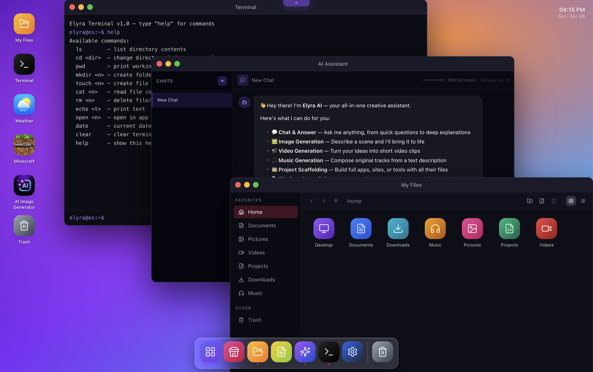
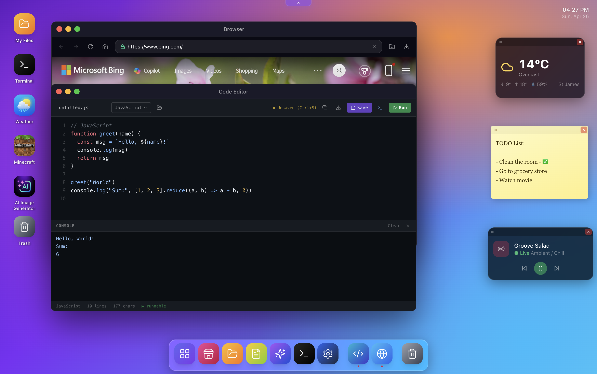
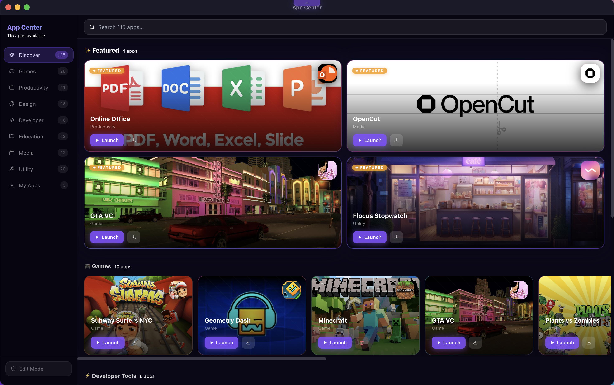
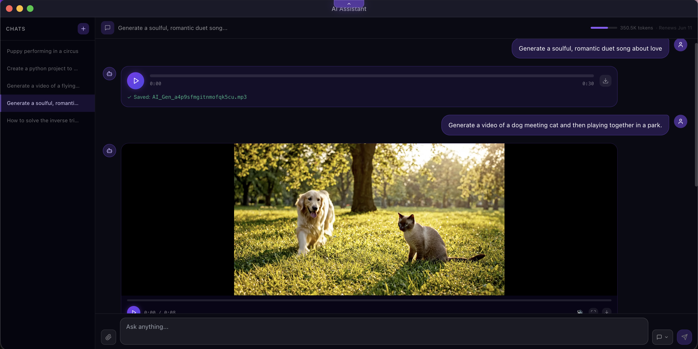

  

  

<h1 align="center">EyOS</h1>

  A browser-based desktop operating system built with React, Vite, Express, and PostgreSQL. 
  Users get a full desktop environment — file manager, code editor, terminal, notepad, AI assistant, 
  camera, video player, and more — all running in the browser, backed by a real database and per-user file storage.

<table width="100%">
  <tr>
    <td width="50%"></td>
    <td width="50%"></td>
  </tr>
  <tr>
    <td width="50%"></td>
    <td width="50%"></td>
  </tr>
</table>

